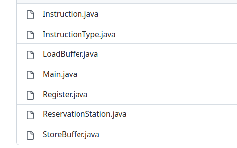

## Tomasulo algorithim 

### 1. Introduction
- Tomasulo's algorithm is a computer architecture hardware algorithm for dynamic scheduling of instructions that allows out-of-order execution and enables more efficient use of multiple execution units. It was developed by John E. Tomasulo in 1967. The algorithm is named after him. The algorithm is used in modern superscalar processors to increase the number of instructions executed per clock cycle. It is a form of dynamic scheduling, which means that the instructions are not scheduled in the order in which they appear in the program. Instead, the instructions are scheduled dynamically, based on the availability of the execution units and the operands. The algorithm is also known as the reservation station algorithm.

### 2. Approach
- Assumptions :
  - Clashes when 2 loads and stores having the same effective address are not handled.
  - Multiple loads and stores can exedcute at the same time whether they have the same effective address or not.
  - When 2 instructions write back at the same time, we follow a FIFO approach where the first one that was issued is the one that will write back to the bus.
  - Reservation Stages and buffers size are dynamic depending on the input.
  - Latencies are dynamic depending on the user input.
  - Memory is dynamic depending on the user input.
  - Number of Floating-Point Registers are 32.
  - Load Instructions always take the same amount of clock cycles to execute, assuming it's always a cache miss.

### 3. Code structure




- The code is divided into 7 main classes:
  - Load Buffer :
  
  	- String name:  representing station name
  	- boolean busy : if it is busy an instruction execution
  	- InstructionType instructionType=InstructionType.LOAD;
  	- int effectiveAddress; : index in memory
  	- int timeRemaining; : time left for execution to finish
    - int destinationIndex; : register index in the register file
    - double destinationValue; : value that will be written in the register file
    - int arrivalTime; : for fifo 

  - Store Buffer :
  	- String name; :  representing station name
  	- boolean busy : if it is busy an instruction execution
  	- InstructionType instructionType=InstructionType.LOAD;
  	- int effectiveAddress: index in memory
  	- int timeRemaining: time left for execution to finish
  	- double V: operand value
    - String Q:  waiting for specific station for operand
   
  
  - ReservationStation:
    - String name : representing station name
  	- boolean busy : if it is busy an instruction execution
  	- Instruction Type: type of the instruction that is in this station. It can be one from (ADD, SUB, MUL, DIV)
  	- double Vj; : operand 1 value
  	- double Vk; : operand 2 value
  	- String Qj; : Station/Buffer that will produce this value
  	- String Qk; : Station/Buffer that will produce this value
  	- int timeRemaining; : time left for execution to finish
    - int destinationIndex; : register index in the register file
    - double destinationValue; : value that will be written in the register file
    - int arrivalTime; : for fifo 
    -   
  - Instruction: which is the class that represents the instruction and it's attributes.
    - InstructionType: which is the Enum that represents the instruction type . Available types are (ADD, SUB, MUL, DIV, LOAD, STORE).
    -  Arithmetic Instruction:
       -  source1: index of the 1st source register
       -  source2: index of the 2nd source register
       -  destination: index of the destination register
       -  effective address : null


    -  Memory Instruction:
       - Store :
         - source1: index of the source register
         -  source2: null
         -  destination : null
         -  effective address : index in the memory that will get affected by the source register value.
       - Load :  
            - source1: null
            -  source2: null
            -  destination : index of the register that value will be written back to
            -  effective address : index in the memory producing the value to the destination

  - Register: 
    - name (F0 to F31)
	- value 
	- Q (Initially = null)
  
  - Sequence
      - 1. Fill the instruction queue by the user input from file we parse each instruction independently then add to instruction queue .
      - 2.  Take input latencies of each instruction from the user.      
      -  3.  Intialize the reservation stations with the default values.
      -  4. Issue an instruction to a reservation station/buffer if there exists a place in the destined station/buffer while also making sure that it wont execute in the same cycle it was issued in, but the next cycle instead.
      - 5. Execute functions :
        - Add reservation stations execute only if both their source operands are ready (Qj & Qk is null in this case);
  		- MUL reservation stations execute only if both their source operands are ready (Qj & Qk is null in this case);
  		- Load Buffers executes immediately if they are busy and they don't want for any source operands since it doesn't have any so they don't listen to the bus since they are not connected to it in the 1st place.
  		- Store buffers execute only if the source operand is available (Q is set to null and V have the register value that will be updated in the memory in the specified address). Also, store updates the memory in its last execution cycle;
      - 6. Write Back:
        - If several instructions want to write back, we choose the one that was issued first, following the FIFO approach.
        -  Stations/Buffers/Reg File are updated if they are waiting for the tag on the bus (Q's are set to nulls in this case and V's are set with the value written on the bus).
        -  Station/Buffer that just wrote back gets emptied out, leaving room for a new instruction to take its place in the next clock cycle.


### 4. Test Cases

#### 1.1. Test Case 1
- Instructions Assembly:

```
L.D F10,100
MUL.D F12,F7,F13
ADD.D F5,F6,F11
DIV.D F6,F5,F2
SUB.D F4,F8,F9
S.D F20,50
```


#### 1.2. Test Case 2

- Instructions Assembly:

```
S.D F6, 90
L.D F6, 120
ADD.D F7, F6, F5
MUL.D F6, F1, F2
DIV.D F7, F7, F2
S.D F7, 150
SUB.D F10,F7,F1
```

- Latencies:
```
Add Latency=3;
SUB Latency=3;
MUL Latency=4;
DIV Latrncy=5;
LOAD Latency=5;
STORE Latency=1;
```


## Contributors
- [Ahmed Wahba](https://github.com/AWahba1)
- [Omar Sherif Ali](https://www.github.com/omar-sherif9992)
- [Abdullah Maged](https://github.com/abdullahmaged377)
- [Marwan Ashraf](https://github.com/Marwan-Ashraf017)
- [Ahmed Reda](https://github.com/Ahmed-Reda-ELdemery)
